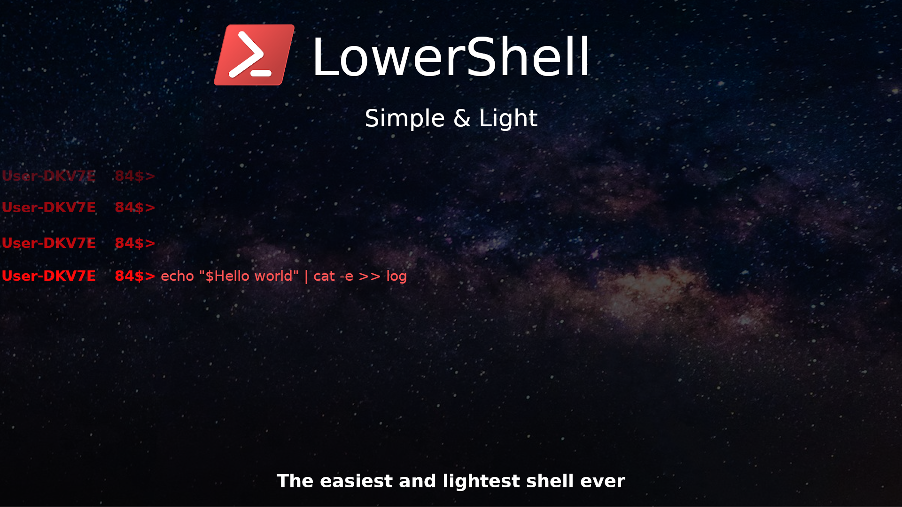
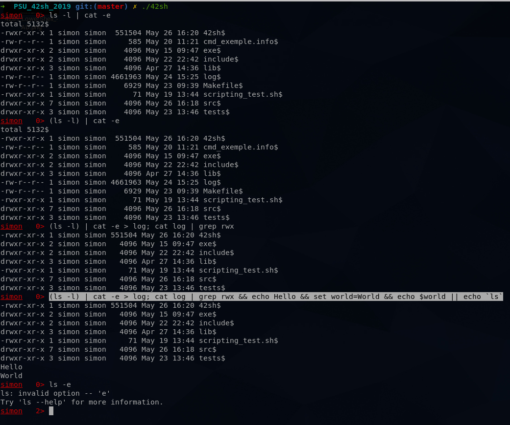
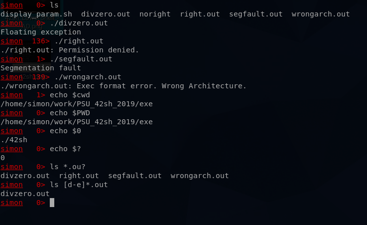

# 42sh

- **Usage:** make && ./42sh
- **Mark:** 95.8%

**Groupe Members:**
- [@SimonRacaud](https://github.com/SimonRacaud)
- [@AurelienJoncour](https://github.com/aurelienjoncour)
- [@sullmin](https://github.com/sullmin)
- [@vincent-andrieu](https://github.com/vincent-andrieu)
- Thomas Jouanolle

# Subject
You must write a UNIX SHELL
For the different commands and compatibility (syntax), the reference shell used will be
tcsh.

# Features
- Spaces and tabs.
- $PATH and environment.
- Errors and returns values.
- Redirections ('<', '>', '<<' and '>>').
- Pipes ('|').
- Builtins: cd, echo, exit, setenv, unsetenv, which, where, history, alias, unalias, clear, repeat, set, unset
- Separators ';', '&&', '||'.
- Inhibitors ('\').
- Globbing ('*', '?', '[]').
- Backticks ('`').
- Parentheses ('(' and ')').
- Variables (local and env).
- Special variables (term, precmd, cwdcmd, cwd, ignoreeof).
- History (key UP and DOWN)
- Aliases
- Line edition (multiline, dynamic rebinding, auto-completion dynamic).
- Scripting

# Exemple

